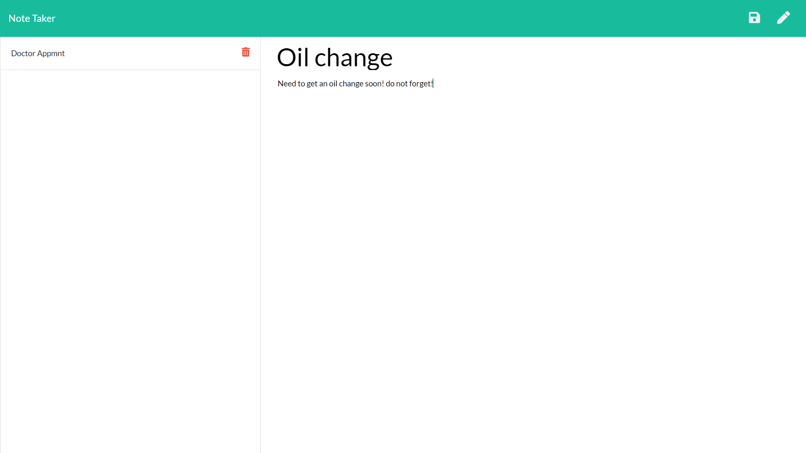

# Note-Taker-WebApp

Note taker Node command line app using express .get, .post, and .delete routes that listens a connection such as localhost and lets you add/view/delete notes and saves the data so you can use and see the notes on different devices or platforms.

**How To Use:**

    1. Clone repository
    2. Run your terminal/CMD with the path set for cloned repository folder
    3. In the terminal, run the command: npm install (a new folder should appear in the repo named node_modules)
    4. Run the command: node server.js, it should return "App listening on PORT: 3000" with no errors
    5. Open your internet browser and go to http://localhost:3000

___________________________________________________________________________________________________________________________________

The app is also deployed on Heroku here: https://anilnotetaker.herokuapp.com/notes
___________________________________________________________________________________________________________________________________

